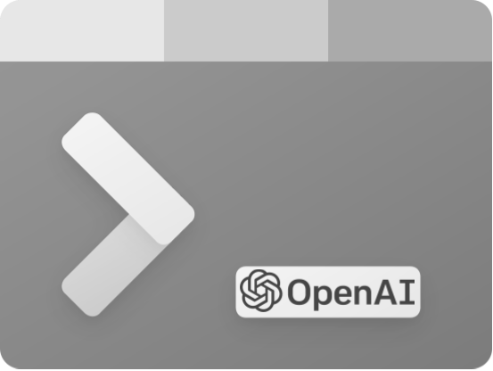

# GPTshell 



GPTshell is an early prototype of a tool for developers to query and interact with ChatGPT's language capabilities. GPTshell's aim is to simplify the process of using natural language processing and increase productivity while developing.

The tool was used during the development of this shell with ChatGPT and OpenAI! Any feedback is welcome as its still an early prototype. 

## Demo

## Features

- Command-line tool
- Supports completion for ease of use
- Handles errors and error messages
- Includes data models for organizing information 
- Provides output formatting for a better user experience
- Contains a Read-Eval-Print-Loop (REPL) functionality
- Designed to increase productivity and simplify the process of natural language processing for developers

## Supported APIs

Note: Initial focus has been on the shell interactivity so currently only supports chat and completions. 

```
✅ completions
✅ chat
🚧 edits
🚧 images
🚧 moderations
🚧 audio
```

# Setup

This assumes you have an [OpenAI Developer Account](https://platform.openai.com/)

## Generate API Token 

[See here for instructions](https://platform.openai.com/account/api-keys)

After generating the token, set the env variable 
```
export OPENAI_API_KEY={API_KEY}
```

## Install via Cargo 
```
cargo install gptrs
```
