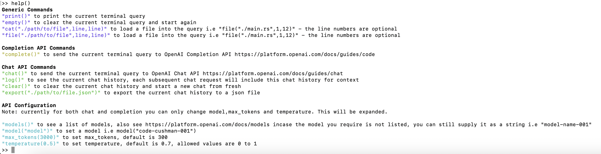

# GPTshell 

GPTshell is an early prototype of a tool for developers to query and interact with ChatGPT's language capabilities. GPTshell's aim is to simplify the process of using natural language processing and increase productivity while developing.

The tool was used during the development of this shell with ChatGPT and OpenAI! Any feedback is welcome as its still an early prototype. 

Download and run `gptshell` in your terminal.

## Why use GPTshell?

Quickly build up powerful queries by loading files of code, specifying specific lines of code and exporting chat sessions for future use. Essentially reducing the feedback loop time with ChatGPT vs using a web browser where you have to navigate between different files, IDEs and copy & paste. 

Example usage - debugging Rust. Rust is notoriously difficult language to learn, and here is an example of how using GPTshell could improve your workflow.

1) Run cmd `cmd("cargo test")` in gptshell (this will run in the current working dir)
2) Output is saved to the current query (run `print()`)
3) Load the file into the current terminal (run `file("./src/main/rs")`)
4) Ask why the tests are failing (or give a specific hint)
5) Run `chat()`
6) Wait for the response from ChatGPT and hopefully this should help you fix your tests (if they are failing)! 

I currently run this in my VSCode so adds a quick feedback loop without having to use ChatGPT in a browser.

## Install via Cargo

```
cargo install gptshell
```

*Recommended way to install while still in development*

## Demo


## Commands

Run `help()` in the GPTshell for a list of these commands.



## Supported APIs

Note: Initial focus has been on the shell interactivity so currently only supports chat and completions. 

```
✅ completions
✅ chat
🚧 edits
🚧 images
🚧 moderations
🚧 audio
```

# Setup

This assumes you have an [OpenAI Developer Account](https://platform.openai.com/)

## Generate API Token 

[See here for instructions](https://platform.openai.com/account/api-keys)

After generating the token, set the env variable 
```
export OPENAI_API_KEY={API_KEY}
```
